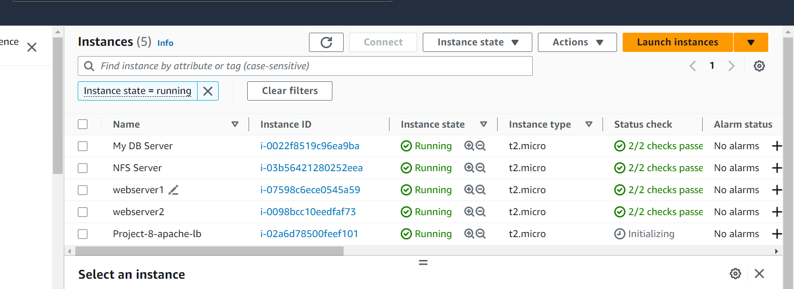

1.  Configure Apache As A Load Balancer
Create an Ubuntu Server 20.04 EC2 instance and name it Project-8-apache-lb, so your EC2 list will look like this:

2. Open TCP port 80 on Project-8-apache-lb by creating an Inbound Rule in Security Group.

3.  Install Apache Load Balancer on Project-8-apache-lb server and configure it to point traffic coming to LB to both Web Servers with the following commands#Install apache2
sudo apt update
sudo apt install apache2 -y
sudo apt-get install libxml2-dev

#Enable following modules:
sudo a2enmod rewrite
sudo a2enmod proxy
sudo a2enmod proxy_balancer
sudo a2enmod proxy_http
sudo a2enmod headers
sudo a2enmod lbmethod_bytraffic

Restart apache2 service with this command `sudo systemctl restart apache2`
Confirm apache2 is running by this command `sudo systemctl status apache2`

4.  Configure load balancing

sudo vi /etc/apache2/sites-available/000-default.conf

#Add this configuration into this section <VirtualHost *:80>  </VirtualHost>

<Proxy "balancer://mycluster">
               BalancerMember http://<WebServer1-Private-IP-Address>:80 loadfactor=5 timeout=1
               BalancerMember http://<WebServer2-Private-IP-Address>:80 loadfactor=5 timeout=1
               ProxySet lbmethod=bytraffic
               # ProxySet lbmethod=byrequests
        </Proxy>

        ProxyPreserveHost On
        ProxyPass / balancer://mycluster/
        ProxyPassReverse / balancer://mycluster/

Restart apache server

sudo systemctl restart apache2

5. Verify that our configuration works by  accessing  the LB’s public IP address or Public DNS name from your browser:
http:/172.31.94.158//index.php

6.  umounted /var/log/httpd/ from your Web Servers to the NFS server – unmount them and make sure that each Web Server has its own log directory.

sudo unmount -lf /var/log/httpd

7. 
Open two ssh consoles for both Web Servers and run following command:

sudo tail -f /var/log/httpd/access_log
[def]: tooling.png
This shows our logins. (I was not able to creat the ?var/log/httpd/access_log)

8. Configure Local DNS Names Resolution

#Open /etc/host file on the  LB server

sudo vi /etc/hosts

#Add 2 records into this file with Local IP address and arbitrary name for both of your Web Servers

172.31.89.179 Web1
172.31.87.211 Web2

Save and quit 
:wq!

9. update the LB config file with those names instead of IP addresses thus

BalancerMember http://Web1:80 loadfactor=5 timeout=1

BalancerMember http://Web2:80 
loadfactor=5 timeout=1

10. curl the Web Servers from LB locally `curl http://Web1` or `curl http://Web2` 

It is omportant to note that this is only internal configuration and it is also local to the LB server, these names will neither be ‘resolvable’ from other servers internally nor from the Internet.

